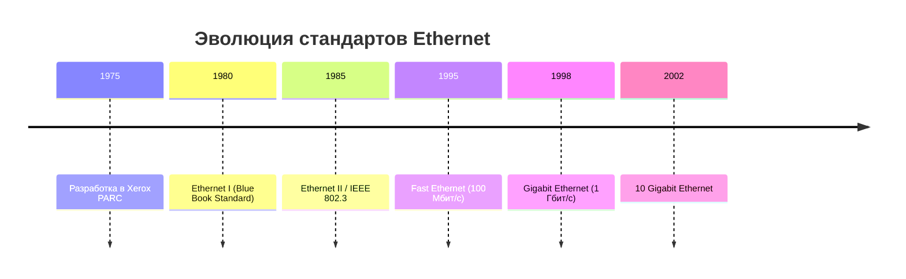

### Лабораторная работа № 1  
## Подключение персонального компьютера к локальной вычислительной сети

> **Дисциплина:** Сети и телекоммуникации  
> **Направление подготовки:** 24.03.2026
>


##  Материально-техническое обеспечение

```
  Персональный компьютер (IBM PC-совместимый)
  Сетевая карта:
    ├─ Шина данных: PCI
    ├─ Производительность: 10–100 Mbit/сек
    └─ Разъем: RJ-45
  Кабель: UTP категории 5 (8 жил, витая пара)
  Коннекторы: Вилки RJ-45 (8P8C)
  Инструмент: Обжимной инструмент (кримпер), стриппер
  Дополнительно: Кабельный тестер или омметр
```

---

##  Теоретическая часть

### 1. История и стандарты Ethernet



#### Модификации IEEE 802.3

| Стандарт | Среда | Макс. длина сегмента | Топология | Статус |
|----------|-------|---------------------|-----------|--------|
| `10Base-5` | Толстый коаксиал (0.5") | 500 м | Шина |  Устарел |
| `10Base-2` | Тонкий коаксиал (0.25") | 185 м | Шина |  Устарел |
| `10Base-T` | UTP Cat.3+ | 100 м |  Звезда |  Актуален |
| `10Base-F` | Оптоволокно | до 2000 м | Звезда |  Специализированный |

>  **CSMA/CD** — Carrier Sense Multiple Access with Collision Detection — метод коллективного доступа с обнаружением коллизий, используемый в Ethernet и Fast Ethernet.

---

### 2. Кабель UTP (Unshielded Twisted Pair)

#### Категории кабеля

```
┌─────────────────────────────────────────┐
│  СРАВНЕНИЕ КАТЕГОРИЙ КАБЕЛЯ UTP       │
├─────────────────────────────────────────┤
│ CAT 5  │ 100 МГц  │ 100 Мбит/с  │  Базовый │
│ CAT 5e │ 125 МГц  │ 1 Гбит/с    │  Рекомендован │
│ CAT 6  │ 250 МГц  │ 1–10 Гбит/с │  Высокая скорость │
│ CAT 6A │ 500 МГц  │ 10 Гбит/с   │  Профессиональный │
│ CAT 7  │ 700 МГц  │ до 100 Гбит/с │  Экранированный │
└─────────────────────────────────────────┘
```

#### Цветовая маркировка жил (4 пары)

| Пара | Цвет 1 | Цвет 2 |
|:----:|--------|--------|
| 1 | 🟦 Синий | ⬜ Белый с синей полосой |
| 2 | 🟧 Оранжевый | ⬜ Белый с оранжевой полосой |
| 3 | 🟩 Зеленый | ⬜ Белый с зеленой полосой |
| 4 | 🟫 Коричневый | ⬜ Белый с коричневой полосой |

---

### 3. Типы кабелей и схемы обжима

####  Прямой кабель (Straight-Through)
> Используется для соединения: **компьютер ↔ коммутатор/роутер**

```
Схема 568B (рекомендуемая) — с обоих концов:

┌─────┬────────────────┬─────┐
│ №   │ Цвет жилы      │ Сигнал │
├─────┼────────────────┼─────┤
│ 1   │  Бело-оранжевый │ TX+  │
│ 2   │  Оранжевый      │ TX-  │
│ 3   │  Бело-зеленый   │ RX+  │
│ 4   |  Синий          | –    │
│ 5   | ⬜🟦 Бело-синий    | –    │
│ 6   | 🟩 Зеленый        | RX-  │
│ 7   | ⬜🟫 Бело-коричневый| –    │
│ 8   | 🟫 Коричневый     | –    │
└─────┴────────────────┴─────┘
```

#### ✖️ Перекрестный кабель (Crossover)
> Используется для соединения: **компьютер ↔ компьютер** или **коммутатор ↔ коммутатор**

```
Один конец — 568B, второй конец — 568A:

568A (альтернативная схема):
1:  Бело-зеленый  │ 2: 🟩 Зеленый
3:  Бело-оранжевый│ 6: 🟧 Оранжевый
(остальные жилы — аналогично)
```

>  **Auto-MDI/MDIX**: Современные коммутаторы автоматически определяют тип кабеля, поэтому перекрестные кабели используются редко.

---

### 4. Интерфейсы и порты

| Тип | Расшифровка | Применение |
|-----|-------------|------------|
| **MDI** | Medium Dependent Interface | Порт сетевого адаптера (ПК, сервер) |
| **MDI-X** | MDI Crossover | Порт активного оборудования (свитч, хаб) |

```
Схема соединений:

 ПК (MDI) ──[Прямой]──> Свитч (MDI-X)
 ПК (MDI) ──[Кросс]───> ПК (MDI)
 Свитч (MDI-X) ──[Кросс]───> Свитч (MDI-X)
```

---

### 5. MAC-адрес

```
 Формат: 6 байт (48 бит) в шестнадцатеричном виде
   Пример: 00:1A:2B:3C:4D:5E

 Структура:
   ├─ Первые 3 байта: OUI (код производителя)
   │  ├─ 00:00:0C → Cisco
   │  ├─ 00:80:C8 → D-Link
   │  └─ 00:A0:24 → 3Com
   └─ Последние 3 байта: Уникальный номер устройства

 Особенности:
   • Присваивается производителем
   • Может быть изменен программно (MAC spoofing)
   • Используется для адресации на канальном уровне (L2)
```

---

##  Практическая часть

### Задание 1: Монтаж патч-корда

####  Алгоритм выполнения


#### ⚠ Важные замечания

>  **Не снимайте изоляцию с отдельных жил!** Контакты коннектора прорезают её при обжиме (технология IDC).  
>  **Длина зачищенного участка** — строго 12–13 мм. Больше — риск повреждения, меньше — ненадежный контакт.  
>  **Проверка обжима**: все 8 контактов должны быть утоплены равномерно, фиксатор кабеля — зажат.

---

### Задание 2: Установка и настройка сетевого адаптера
####  Определение параметров адаптера

```bash
# Просмотр базовой конфигурации
ipconfig

# Полная информация (включая MAC-адрес)
ipconfig /all

# Пример вывода:
#    Описание . . . . . . . . . . . : Realtek PCIe GBE Family Controller
#    Физический адрес . . . . . . . : 00-1A-2B-3C-4D-5E
#    IPv4-адрес . . . . . . . . . . : 192.168.1.15
#    Маска подсети . . . . . . . . : 255.255.255.0
#    Основной шлюз . . . . . . . . : 192.168.1.1
```

#### 🔌 Проверка физического подключения

```
🟢 Индикатор на сетевой карте:
   • Зеленый (постоянный) — линк установлен
   • Желтый/оранжевый (мигающий) — передача данных
   • Красный/не горит — нет соединения

 Возможные проблемы:
    Кабель не до конца вставлен в разъем
    Неправильная схема обжима
    Повреждение жил или коннектора
    Неверный тип кабеля (прямой вместо кросс)
```

---

## 📊 Результаты работы

| Параметр | Значение |
|----------|----------|
| **Тип смонтированного кабеля** | `Прямой / Перекрестный` *(выбрать)* |
| **Схема обжима** | `568A / 568B` |
| **Количество жил** | `4 / 8` |
| **Результат проверки тестером** | ` Все пары /  Ошибка в паре №__` |
| **Модель сетевой карты** | `________________________` |
| **MAC-адрес адаптера** | `__:__:__:__:__:__` |
| **Производитель (по OUI)** | `________________________` |
| **Поддерживаемые скорости** | `10 / 100 / 1000 Мбит/с` |

> 📎 *Приложить скриншоты: вывод `ipconfig /all`, фото смонтированного кабеля, результат тестирования.*

---

##  Контрольные вопросы

<details>
<summary><strong>1. Какие кабели использует Ethernet? Достоинства и недостатки UTP?</strong></summary>

 **Используемые кабели:** коаксиальные (10Base-2/5), витая пара (10/100/1000Base-T), оптоволокно (10Base-F).

 **UTP (Unshielded Twisted Pair):**
- **Достоинства:** низкая стоимость, простота монтажа, гибкость, достаточная производительность для ЛВС.
- **Недостатки:** чувствительность к электромагнитным помехам, ограничение длины сегмента (100 м).

</details>

<details>
<summary><strong>2. Что такое MDI/MDI-X? Когда нужен кросс-кабель?</strong></summary>

 **MDI** — порт конечного устройства (ПК), где пины 1,2 — передача, 3,6 — прием.  
 **MDI-X** — порт активного оборудования, где пины 1,2 — прием, 3,6 — передача.

 **Кросс-кабель** нужен при соединении однотипных портов: ПК↔ПК, свитч↔свитч. При наличии Auto-MDI/MDIX не требуется.

</details>

<details>
<summary><strong>3. Почему не снимают изоляцию с жил при обжиме RJ-45?</strong></summary>

 Контакты коннектора выполнены в виде острых ножей (технология **IDC** — Insulation Displacement Connection). При обжиме они прорезают изоляцию и обеспечивают надежный электрический контакт с медной жилой. Снятие изоляции вручную может привести к повреждению жилы и ухудшению контакта.

</details>

<details>
<summary><strong>4. Что такое «нуль-модемный» кабель?</strong></summary>

 Кабель для прямого соединения двух устройств типа DTE (например, ПК↔ПК) без использования модема или активного оборудования. В контексте Ethernet — это перекрестный кабель, где пары передачи и приема перекрещены.

</details>

<details>
<summary><strong>5. Как идентифицируются сетевые адаптеры? Зачем менять MAC-адрес?</strong></summary>

 Уникальная идентификация — по **48-битному MAC-адресу**, присваиваемому производителем.

 **Причины изменения (MAC spoofing):**
- Обход привязки по MAC в сетях провайдеров
- Тестирование сетевой безопасности
- Конфиденциальность в публичных сетях
- Замена сгоревшего адаптера без перенастройки сети

</details>

<details>
<summary><strong>6. Что настраивается при конфигурировании сетевой платы?</strong></summary>

 **Аппаратные параметры** (для старых карт без PnP):
- Базовый адрес портов ввода-вывода (I/O Base Address)
- Номер запроса прерывания (IRQ)
- Адрес DMA-канала (если используется)

 **Сетевые параметры** (программная настройка):
- IP-адрес, маска подсети, шлюз
- Адреса DNS-серверов
- Имя хоста, рабочая группа

 Современные адаптеры с **Plug-and-Play** настраиваются ОС автоматически.

</details>

---

##  Выводы

```
 В ходе работы освоены практические навыки:
   • Распознавание типов сетевых кабелей и разъемов
   • Монтаж коннекторов RJ-45 по схемам 568A/568B
   • Проверка целостности кабельной линии тестером
   • Определение параметров сетевого адаптера в ОС

 Закреплены теоретические знания:
   • Принцип работы Ethernet и стандарты 802.3
   • Назначение и структура MAC-адреса
   • Различия между прямым и перекрестным кабелем
   • Роль портов MDI/MDI-X в построении ЛВС

⚠ Типичные ошибки при монтаже:
 • Неравномерная обрезка жил → плохой контакт
   • Нарушение порядка цветов → неработоспособность
   • Недостаточный обжим → периодические обрывы
```

---
### Ответы на вопросы
# Ответы на контрольные вопросы

---

## 1️⃣ Какие кабели использует Ethernet? Достоинства и недостатки UTP?

### Кабели Ethernet:
| Тип | Описание | Применение |
|-----|----------|------------|
| **UTP** (Unshielded Twisted Pair) | Витая пара без экрана | Офисные/домашние сети |
| **STP/FTP** | Витая пара с экраном | Промышленные сети, помехи |
| **Оптоволокно** | Передача светом | Магистрали, большие расстояния |
| **Коаксиальный** | Устаревший (10Base2) | Историческое значение |

### 🔹 Достоинства UTP:
✅ Дешевизна и доступность  
✅ Гибкость, простота монтажа  
✅ Достаточно для 10/100/1000 Мбит/с на 100 м  
✅ Легко обжимается разъёмом RJ-45  

### 🔹 Недостатки UTP:
❌ Чувствителен к электромагнитным помехам  
❌ Ограничение длины — 100 метров  
❌ Нет экранирования (утечка сигнала)  
❌ Менее защищён от прослушивания  

---

## 2️⃣ Что такое MDI/MDI-X? Когда нужен кросс-кабель?

### Определения:
- **MDI** (Medium Dependent Interface) — интерфейс, где **пины 1,2 — передача (TX)**, **3,6 — приём (RX)**  
  → Компьютеры, серверы, маршрутизаторы

- **MDI-X** (Medium Dependent Interface Crossover) — интерфейс с **перекрёстными пинами**: **1,2 — приём (RX)**, **3,6 — передача (TX)**  
  → Коммутаторы, концентраторы

### 🔄 Когда какой кабель:

| Соединение | Тип кабеля | Почему |
|------------|------------|--------|
| ПК ↔ Коммутатор | **Прямой** (Straight) | MDI ↔ MDI-X (сигналы совпадают) |
| ПК ↔ ПК | **Кросс-кабель** (Cross) | MDI ↔ MDI (нужно перекрестить TX/RX) |
| Коммутатор ↔ Коммутатор | **Кросс-кабель** | MDI-X ↔ MDI-X |

> 💡 **Современные устройства** поддерживают **Auto-MDI/MDI-X** — автоматически определяют тип кабеля, поэтому кросс-кабели сейчас редкость.

---

## 3️⃣ Почему не снимают изоляцию с жил при обжиме RJ-45?

### Причины:
1. **Конструкция разъёма**: Внутри RJ-45 есть **ножевые контакты (IDC — Insulation Displacement Contact)**, которые:
   - Прорезают изоляцию при обжиме
   - Обеспечивают надёжный электрический контакт с медной жилой

2. **Механическая прочность**: Изоляция фиксирует жилу в разъёме, предотвращая обрыв при изгибе кабеля

3. **Защита от окисления**: Изоляция защищает медь от воздуха и влаги

4. **Предотвращение КЗ**: Исключает случайное замыкание соседних жил

> ⚠️ Если снять изоляцию — контакт будет ненадёжным, жила может обломиться, а соединение — окислиться.

---

## 4️⃣ Что такое «нуль-модемный» кабель?

### Определение:
**Нуль-модемный кабель** — кабель для прямого соединения двух **последовательных портов (COM/RS-232)** с перекрёстной передачей сигналов.

### Схема перекрёста:
```
Сторона А          Сторона Б
────────           ────────
TXD (2) ─────────> RXD (3)
RXD (3) ─────────> TXD (2)
GND (5) ─────────> GND (5)
```

### Применение:
- Настройка сетевого оборудования через консольный порт
- Прямая передача файлов между старыми ПК
- Отладка встраиваемых систем

### Отличие от кросс-кабеля:
| Параметр | Нуль-модемный | Кросс-кабель (Ethernet) |
|----------|---------------|-------------------------|
| Интерфейс | RS-232 (COM) | Ethernet (RJ-45) |
| Сигналы | TXD/RXD, RTS/CTS | TX/RX пары |
| Применение | Консоли, микроконтроллеры | Сетевые устройства |

---

## 5️⃣ Как идентифицируются сетевые адаптеры? Зачем менять MAC-адрес?

### Идентификация адаптеров:
1. **MAC-адрес** — уникальный 48-битный идентификатор (например: `00:1A:2B:3C:4D:5E`)
   - Первые 24 бита — код производителя (OUI)
   - Последние 24 бита — серийный номер устройства

2. **Дополнительно**:
   - Имя устройства в ОС
   - Номер IRQ, адрес I/O (аппаратно)
   - Индекс интерфейса (в современных ОС)

### 🔧 Зачем менять MAC-адрес (спуфинг):

| Причина | Описание |
|---------|----------|
| **Конфиденциальность** | Скрытие реального устройства в публичных сетях |
| **Обход фильтрации** | Если в сети разрешён доступ по белому списку MAC |
| **Тестирование** | Проверка работы сетевого ПО с разными адресами |
| **Восстановление** | Замена сгоревшего адаптера без перенастройки сети |
| **Анонимизация** | В пентестинге и исследовании безопасности |

> ⚠️ **Важно**: Смена MAC-адреса может нарушать политику сети и законодательство.

**Как сменить (примеры):**
```bash
# Linux
sudo ip link set dev eth0 address 00:11:22:33:44:55

# Windows (через реестр или свойства адаптера)
# Через PowerShell:
Set-NetAdapter -Name "Ethernet" -MacAddress "00-11-22-33-44-55"
```

---

## 6️⃣ Что настраивается при конфигурировании сетевой платы?

### Основные параметры:

| Категория | Параметры |
|-----------|-----------|
| **Физический уровень** | Скорость (10/100/1000 Мбит/с), дуплекс (полный/полудуплекс), автосогласование |
| **Адресация** | • Статический IP / DHCP<br>• Маска подсети<br>• Шлюз по умолчанию |
| **DNS и имя** | • DNS-серверы (основной/альтернативный)<br>• Имя хоста, домен |
| **Протоколы** | Включение/отключение IPv4, IPv6, NetBIOS |
| **Безопасность** | • Брандмауэр (правила)<br>• 802.1X аутентификация |
| **Дополнительно** | • MTU (размер пакета)<br>• Wake-on-LAN<br>• Приоритет трафика (QoS) |

### Пример конфигурации (Windows):
```
IP-адрес:        192.168.1.100
Маска:           255.255.255.0
Шлюз:            192.168.1.1
Предпочтительный DNS:  8.8.8.8
Альтернативный DNS:    8.8.4.4
```

### Пример (Linux, `/etc/network/interfaces`):
```bash
auto eth0
iface eth0 inet static
    address 192.168.1.100
    netmask 255.255.255.0
    gateway 192.168.1.1
    dns-nameservers 8.8.8.8 8.8.4.4
```

---

> 📌 **Итог**: Понимание этих основ необходимо для настройки надёжных и безопасных сетевых соединений.
