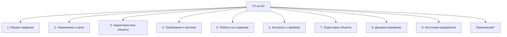

# 📘 Лабораторная работа №9  
## ГОСТ 34.602-89: Техническое задание на создание автоматизированной системы

> 📌 *Документ структурирован в соответствии с требованиями стандарта и адаптирован для учебного использования*

---

## 🔹 Часть 1. Общие положения

| Пункт | Содержание |
|-------|-----------|
| **1.1** | ТЗ — основной документ, определяющий требования, порядок создания и приёмки АС |
| **1.2** | Разрабатывается на систему в целом; допускается разработка ТЗ на части, подсистемы, ПО, ТЗ по ЕСКД/ЕСПД/ГОСТ 19 |
| **1.3** | Требования могут быть включены в задание на проектирование объекта — тогда отдельное ТЗ не требуется |
| **1.4** | Требования должны соответствовать современному уровню НТ и не ограничивать поиск оптимальных решений разработчиком |
| **1.5** | Основание: исходные данные, включая стадию «Исследование и обоснование создания АС» (ГОСТ 24.601) |
| **1.6** | Включаются только требования, дополняющие общие НТД и определяемые спецификой объекта |
| **1.7** | Изменения оформляются дополнением или протоколом (подписи заказчика и разработчика); на титуле — «Действует с …» |

---

## 🔹 Часть 2. Состав и содержание ТЗ



> *Приложения включаются по согласованию: расчёт эффективности, оценка НТУ системы*

### 📑 Детализация разделов

#### 1️⃣ Общие сведения
- Наименование системы и условное обозначение
- Шифр темы/договора
- Реквизиты заказчика и разработчика
- Основания для создания (утверждённые документы)
- Сроки начала/окончания работ
- Источники и порядок финансирования
- Порядок предъявления результатов

#### 2️⃣ Назначение и цели
```markdown
2.4.1 Назначение:
  • Вид автоматизируемой деятельности
  • Перечень объектов/органов управления

2.4.2 Цели:
  • Требуемые значения показателей (технических, экономических)
  • Критерии оценки достижения целей
```

#### 3️⃣ Характеристика объектов автоматизации
- Краткие сведения или ссылки на документы
- Условия эксплуатации, характеристики среды
- *Для САПР*: параметры объектов проектирования

#### 4️⃣ Требования к системе *(наиболее объёмный раздел)*

| Подраздел | Ключевые элементы |
|-----------|-----------------|
| **4.1. Система в целом** | Структура, персонал, надёжность, безопасность, эргономика, защита информации, стандартизация, патентная чистота |
| **4.2. Функции (задачи)** | Перечень функций по подсистемам, временной регламент, качество вывода, критерии отказов |
| **4.3. Виды обеспечения** | Математическое • Информационное • Лингвистическое • Программное • Техническое • Метрологическое • Организационное • Методическое |

#### 5️⃣ Работы по созданию системы
- Стадии и этапы (по ГОСТ 24.601) с указанием сроков и исполнителей
- Перечень выходных документов (ГОСТ 34.201)
- Порядок экспертизы технической документации
- Программы обеспечения надёжности и метрологии *(при необходимости)*

#### 6️⃣ Порядок контроля и приёмки
```markdown
✓ Виды и методы испытаний
✓ Состав и статус приёмочной комиссии
✓ Порядок согласования приёмочной документации
✓ Критерии успешного прохождения испытаний
```

#### 7️⃣ Подготовка объекта к вводу в действие
- Приведение данных к машиночитаемому виду
- Организационные изменения в объекте автоматизации
- Создание условий, гарантирующих соответствие ТЗ
- Формирование подразделений, обучение персонала

#### 8️⃣ Документирование
- Перечень документов по ГОСТ 34.201 и отраслевым НТД
- Требования к оформлению (ЕСКД/ЕСПД)
- Документы на машинных носителях, микрофильмирование
- Порядок ведения версий и конфигурационного управления

#### 9️⃣ Источники разработки
> ТЭО • Отчёты НИР • Материалы по аналогам • Нормативные акты • Экспертные заключения

---

## 🔹 Часть 3. Правила оформления

```diff
+ Формат: А4 (ГОСТ 2.301), без рамки и основной надписи
+ Нумерация: вверху страницы, после кода ТЗ
+ Показатели: с предельными отклонениями или ссылкой на НТД
+ Титульный лист: подписи + гербовая печать заказчика/разработчика
+ Отраслевые коды: гриф секретности, код работы, рег. номер — по необходимости
```

### 🔄 Оформление дополнений к ТЗ
| Элемент | Требование |
|---------|-----------|
| Титул | «Дополнение № … к ТЗ на АС …» |
| Содержание | Основание → Изменение → Ссылка на пункт основного ТЗ |
| Глаголы-маркеры | `заменить` • `дополнить` • `исключить` • `изложить в новой редакции` |

---

## 🔹 Приложение: Порядок разработки, согласования и утверждения

```mermaid
flowchart LR
    A[Разработка\n(разработчик + заказчик)] --> B[Согласование\n≤15 дней/орг.]
    B --> C{Разногласия?}
    C -->|Да| D[Протокол разногласий]
    C -->|Нет| E[Утверждение\nруководителями]
    D --> E
    E --> F[Рассылка копий\nв течение 10 дней]
    F --> G[Учёт и хранение\nпо ГОСТ 2.501]
```

### 📋 Ключевые этапы

| Этап | Ответственные | Срок/Условие |
|------|--------------|--------------|
| **Разработка проекта** | Разработчик при участии заказчика | На основе ТТ/заявки |
| **Согласование** | Заказчик + разработчик в своих ведомствах | ≤15 дней на организацию |
| **Работа с замечаниями** | Разработчик + заказчик | До утверждения ТЗ |
| **Нормоконтроль и метроэкспертиза** | Службы разработчика | Перед утверждением |
| **Утверждение** | Руководители предприятий | Совместно |
| **Рассылка** | Разработчик | ≤10 дней после утверждения |
| **Внесение изменений** | Заказчик + разработчик | Запрещено после начала ПСИ |

> ⚠️ **Важно**: Изменения не допускаются после представления системы к приёмо-сдаточным испытаниям.

---

> 💡 **Практическая рекомендация**:  
> При подготовке ТЗ для госзаказчиков дополнительно учитывайте:  
> • ФЗ-152 «О персональных данных»  
> • ФЗ-187 «О безопасности КИИ»  
> • Требования ФСТЭК/ФСБ по защите информации  
> • Методические рекомендации Минцифры (отечественное ПО, реестр российского ПО)  
>   
> *Эти требования оформляются в приложениях или отдельных подразделах, не нарушая структуру ГОСТ 34.602-89.*
